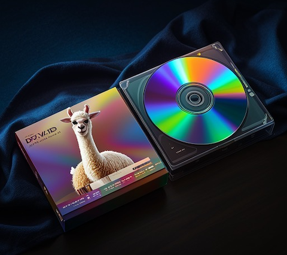

The term RAG, is always mystical to me......What are the exact meaning of these letters? To alleviate the stress from thinking, I decided to call my project as llama.DVD concisely, which means **D**ocument **V**ectorization **D**igging, it is constructed with the technique of RAG, and works with [llama.cpp](https://github.com/ggerganov/llama.cpp)

If you have no idea about RAG,LLM or anything related, it is advisable to leave now, because following content may give you headache or lethargy.

## Principle
There are two parts:Embedding and Query. The former is used to translate your document from human language to maths language (vectorization), this is done to make it faster to look up something from the content of your document. The latter, does a little bit more work,it also translates your queries to maths language, and then uses it to find out relevant content based on the vector dataset which was generated by previous Embedding, next, passes them to LLM, finally, you get response by LLM. That is all, what RAG doing, if I am not mistaken.

May I remind you: They are independent of each other, that means, you do not have to do **Embedding** each time you query something, since the vector dataset which works for your queries is kept working once it was generated. On other hand, you should not make **Query** for your document before making embedding for it. In short, they don't run synchronously.

## Components
This project is made with Python. As mentioned above, there are two major  scripts: *vectorize.py* and *dig.py*.

---

**vectorize.py**, as the name suggests, generates a vector dataset based on the content of your document. Here is its arguments list:
```
-d <Name of your document,needful.>
-t <Token length> (Forget it if you are not familiar with it, neither me.)
```
Copy your text document (suppose it is called "mydoc.txt") into the subfolder names *"documents"*, and then run this script:
```
python vectorize.py -d mydoc.txt
```
Please wait for a while, depending on the size of your document and the performance of your computer......after done, you can then check the result:
```
Mac OS/Linux>echo $?
```
or
```
Microsoft Windows>echo %ERRORLEVEL%
```
A number should be shown, if it is zero, good, otherwise, open this script with your text editor, find out the code line which contains that number, analyse it, and then do something to resolve the problem if you are confident in your programming ability, or, just remove this suite, do something else worthwhile. 

---

**dig.py**, which allows you to submit queries about the content of your document to *llama.cpp server*. Here is the list of arguments:
```
-q <Your query, wrapped with double quotation marks, needful.>
-c <1 or higher, the richness level. Higher means more accurate, but slower.>
-o <By default, its value is 1, which means NO query will be sent to LLM server.>
```
Before you launch it, please enable *llama.cpp server* with this: 
`./server.run` , and you can stop the *server* later: `./stop.run` . For Microsoft Windows user, run this to enable *llama.cpp server*: `server.vbs`, and this to stop it: `stop.vbs`. Note: *llama.cpp server* provides service with this local URL *http://localhost:8080*, you may access it to verify whether service is enabled.

Don't forget to set permissions for both ".run" scripts in your Mac OS/Linux system before you launch them: `chmod 755 server.run`

Once *llama.cpp server* is enabled, you can submit any query about the content of your document to it. Following demonstrates how to query about "Test":
```
python dig.py -q "Test" -c 2 -o 0
```
If you don't want to talk to *llama.cpp server*, please set the argument *-o* to 1, or, just skip it.
```
python dig.py -q "Test" -c 2
```

---

- The built-in text document is called "genesis.txt", is taken from parts of the Bible, its vector dataset has been generated, there is no need to make embedding for it by yourself (unless the vector dataset was changed or removed), you can query something about it directly, like this:
```
python dig.py -q "Who is Adam" -c 2 -o 0
```

- Everytime you make embedding for your document, the existing vector dataset is **overwritten**, subsequent query will take it as usual, you don't have to modify any dataset or model manually.

- If you want to switch to another model for *llama.cpp server*, please place the model (file) into subfolder names *"models"* and **rename** this model to be *_* (underline). Similarly, one level down from *"models"* subfolder, there is a subfolder names *"embedding"*, that is: *models/embedding*, you can copy embedding model files there, if you want to try another embedding model. Be aware, you should clear this subfolder before copying to avoid chaos.

## Supplement
Why do I create this project? Well, I try to put the technical idea of RAG into practice and see how far it can go, another reason is, get rid of the annoying "Version Restriction", I mean, I was going to run a llama.cpp-based application that was widely acclaimed, unfortunately, it doesn't work on macOS with version earlier than 11(Big Sur), that says, it can't work on my macOS Catalina......I really don't see how the functionality of that application has much to do with the version of OS, can I bypass these inexplicable constraints to achieve what I want?

At present, this is a conceptual design, not a full-fledged application, so, it is not necessasry to compare it with others. However, it will be upgraded continuously, and your comments are welcome.


